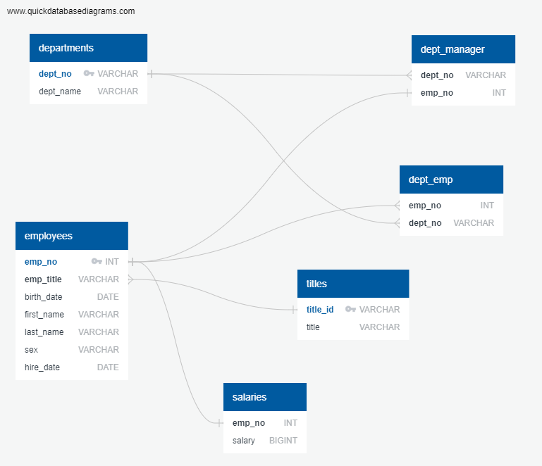

# sql-challenge
SQL challenge for RUTGERS data science bootcamp

# Employee Database: A Mystery in Two Parts
It is a beautiful spring day, and it is two weeks since you have been hired as a new data engineer at Pewlett Hackard. Your first major task is a research project on employees of the corporation from the 1980s and 1990s. All that remain of the database of employees from that period are six CSV files.

This projects provides the answer to the "Employee Database: A Mystery in Two Parts" assignment:

* DB ER Diagram  - is provided in file "EDR.png"
* Queries - are provided in file "Queries.sql"
* Bonus question - is provided in file "Bonus_SQL.ipynb"

### Prerequisites

1. Python
2. Matplotlibs
3. Jupyter notebook
4. PostgreSQL v13
5. NumPy
6. pandas
7. sqlalchemy
8. psycopg2
9. pgAdmin v4.29

## ER Diagram

## Running the tests

1. Start PostgreSQL through pgAdmin
2. Create a DB called "EmployeeDB"
3. Open the query Tool for the DB you just created
4. Execute the file "QuickDBD-Free Diagram.sql" to create the DB schema
5. Import the CSV files to their each respective tables through Import wizard (Preferred-check screenshot below) in this sequence - titles, departments, employees, dept_emp, dept_manager, salaries
    * **or** by executing "csv_import_query.sql" (for this you have to change security settings under properties of each files and provide access to everyone)
6. Execute the file "Queries.sql"
7. Finally, to run the python (SQLAlchemy) part of the assignment, please load file "Bonus_SQL.ipynb" in Jupyter Notebook and execute it.

## CSV import wizard

## Salaries histogram

Below is the histogram chart for salaries for employees:

## Average salaries by titles

Below is the bar chart for average salaries for each titles:

